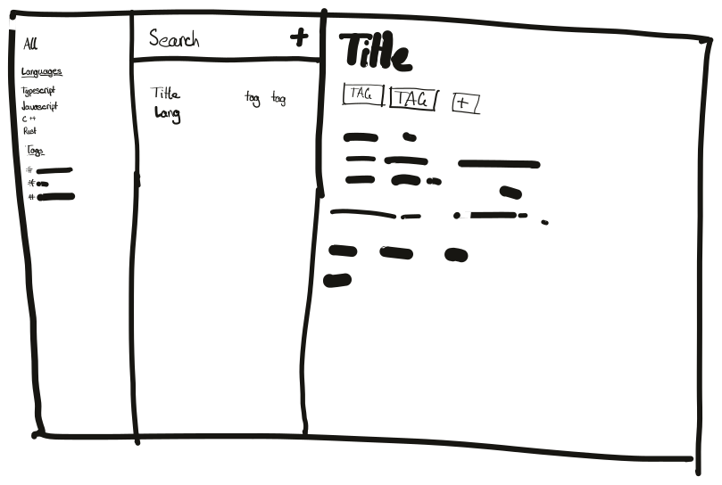

# SnippetMan

A proof of concept gecko application for managing code snippets.

<picture>
    <source media="(prefers-color-scheme: dark)" srcset="./assets/sketch_dark.svg" />
    
</picture>

## Building

First, create a folder to house your application for development:

```bash
mkdir cleandir
cd cleandir
```

Then clone the firefox source code, either via `git clone`:

```bash
git clone --depth 1 https://github.com/mozilla/gecko-dev mozilla-central
```

Clone this repository:

```bash
git clone https://github.com/trickypr/snippetman
```

Keep track of the location of `mozilla-central`:

```bash
echo $PWD/mozilla-central > snippetman/.moz-central
```

Now, we need to add our app to the gecko source code:

```bash
# On linux add -r to each of the following commands
ln -s snippetman/boilerplate mozilla-central/snippetman
ln -s snippetman/snippetman-sym.mozconfig mozilla-central/.mozconfig
```

Apply custom patches:

```bash
cd snippetman
./patches.sh import
cd ..
```

Configure and build your application:

```bash
cd mozilla-central
./mach configure
./mach build
```

Then run it:

```bash
./mach run
```
